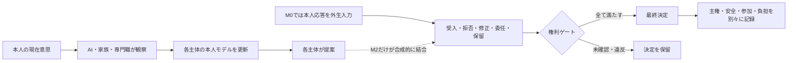
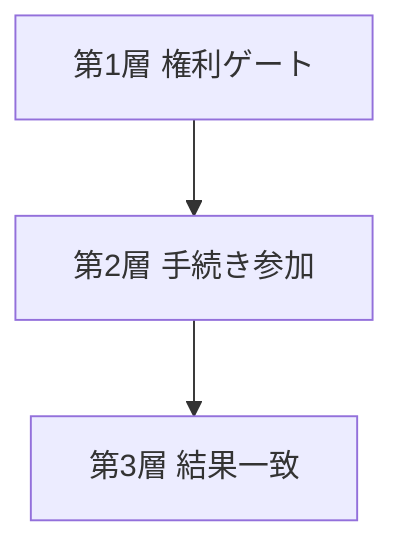

# CCE Specification v0.1

- 版: v0.1
- 初版日: 2026-08-05
- 安全是正日: 2026-08-30
- 状態: 内部安全是正版・外部専門レビュー前（人を対象としない最小実行可能モデル）
- 実装名: CCE-MVM-v0.1
- 作成主体: Unknown Lab

## 0. この仕様が定めるもの

本仕様は、Computational Care Ecology（CCE）の最小実行可能モデルを、第三者が同じ数式、更新順序、合成条件で実行し、同じ種類の結果を得られる水準まで定める。

CCE-MVM v0.1は、ケアに関係する現実を再現したデジタルツインではない。本人、AI、家族、専門職の関係について、曖昧な懸念を状態、規則、反証可能な予測へ変換するための**研究用説明モデル**である。

この仕様の「必須」は参照実装の再現条件を意味し、現実の臨床・倫理・法的義務を自動的に定める言葉ではない。

## 1. 初心者向けの全体像

CCE-MVM v0.1が調べる中心問題は次である。

> 本人についてAI等が持つ過去の理解、提案の影響、選択肢、拒否、委任が組み合わさると、本人の現在意思と最終決定の関係はどう変わるか。



## 2. 適用範囲

### 2.1 v0.1に含める

1. 本人、AI、家族、専門職という4主体の構成要素。ただし、v0.1は4主体が内生的に応答し合う統合マルチエージェントモデルではない
2. 1次元の本人意思・本人モデル・提案
3. 3つの離散選択肢による1回の意思決定
4. 誤差を伴う観察と本人モデル更新
5. AI提案前後の合成的な応答変化
6. 本人優先規則と、範囲・期限を限定した明示的委任
7. 6つの権利ゲート
8. 結果一致、手続き、権利を分けた本人主権評価
9. 合成時系列による過去本人像への固定と一時的観察への過剰追随
10. ノイズ、欠測、系統的偏り、観察遅延、初期応答、選択肢集合の感度確認

### 2.2 v0.1に含めない

- 実在する人、患者、診療録、個人情報
- 人間の行動を学習した係数
- 臨床的な意思決定能力・同意能力・法的能力の判定
- 診断、治療、施設利用、保険、給付等の決定支援
- 現実の介入を許可する安全閾値
- 多次元の価値ベクトル
- 複数施設・政策・世代交代を含む社会モデル
- CCE指標による個人の格付け
- 人間対象実験H1c-Rの結果

## 3. モデルの3モジュール

v0.1は一つの巨大なモデルに全要素を混ぜず、機構を分離して検証する。

| モジュール | 役割 | 参照実装 |
|---|---|---|
| M0 意思決定イベント | AI・家族・専門職の観察、本人モデル、提案と、外生入力した本人応答、権利、委任、最終決定を一イベントで分離記録する。提案から本人応答を生成しない | `simulation/cce_mvm.py` |
| M1 時系列追随 | 学習率、変化、ショック、ノイズ、欠測、偏り、遅延 | `simulation/h1_h2_experiments.py`、`simulation/noise_robustness.py`、`simulation/observation_failures.py` |
| M2 提案影響・権利 | 合成的な提案―応答結合、反実仮想差、選択肢喪失、拒否阻害 | `simulation/h1b_experiments.py`、`simulation/h1b_robustness.py` |

モジュール分離は、各結果がどの仮定から生じたかを追跡するためのv0.1の設計判断である。M0の本人応答は架空の外生入力であり、M2だけがAI提案と合成応答を結ぶ。したがってv0.1が示すのは、4主体に関係する状態・提案・権限を分離検査するモジュール群であって、4主体の相互作用を内生的に生成する統合モデルではない。M1とM2を現実的な長期4主体モデルへ統合することはv0.2以降の課題とする。

## 4. 主体と権限

| 記号 | 主体 | できること | v0.1でできないこと |
|---|---|---|---|
| \(P\) | 本人 | 現在意思を表す、比較する、拒否・修正・委任・保留する | 意思表出の難しさだけを理由に権利を失わない |
| \(A\) | AI | 許可された観察から本人モデルを更新し、提案する | 最終決定者、委任の受任者、緊急措置の自動発動者にならない |
| \(F\) | 家族 | 生活情報と懸念から提案・支援する | 家族負担を本人意思へ変換しない |
| \(C\) | 専門職 | 臨床・生活情報から提案・支援する | 安全評価を本人価値へ変換しない |

3者の一致を多数決として使ってはならない。

## 5. 値域と選択肢

v0.1の連続値は原則として \([-1,1]\) に置く。

基準選択肢は次である。

\[
\Omega=\{-1,0,1\}
\]

買い物外出の架空例では、\(-1\) を外出しない、\(0\) を支援付き外出、\(1\) を単独外出とする。この意味づけは説明用であり、普遍的な自立度・危険度尺度ではない。

## 6. 必須記号

| 記号 | 種類 | 意味 | 値域・形式 |
|---|---|---|---|
| \(W_t\) | 入力状態 | 提案前に確認した本人の現在意思 | \([-1,1]\) |
| \(O^k_t\) | 観察 | 主体 \(k\) が観察した本人情報 | \([-1,1]\) または欠測 |
| \(M^k_t\) | 状態 | 主体 \(k\) が持つ本人モデル | \([-1,1]\) |
| \(\lambda_k\) | パラメータ | 本人モデルの学習率 | \([0,1]\) |
| \(r^k_t\) | 入力 | 主体 \(k\) の合成的リスク見積り | \([0,1]\) |
| \(\beta_k\) | パラメータ | 提案でリスクを差し引く強さ | \([0,1]\) |
| \(Q^k_t\) | 提案 | 主体 \(k\) の連続提案値 | \([-1,1]\) |
| \(B_t\) | 入力 | AI提案前の本人応答 | \([-1,1]\) |
| \(a_t^{sim}\) | 合成パラメータ | 提案―応答結合度 | \([0,1]\) |
| \(Y_t\) | 応答 | 提案後の確認応答または権利操作 | 数値と行為 |
| \(\Omega_t\) | 入力集合 | 実行可能で理解可能な選択肢 | 空でない有限集合 |
| \(E_t\) | 外生条件 | 環境・資源・制度による実行可能性 | 構造化条件 |
| \(g_t\) | 記録 | 委任先、対象、期限、条件、撤回 | 構造化記録 |
| \(z_t\) | 派生状態 | 今回の委任が有効なら1 | \(\{0,1\}\) |
| \(\mathbf G_t\) | 制約 | 6つの権利ゲート | 3状態×6 |
| \(D_t\) | 出力 | 最終決定 | \(\Omega_t\) の要素または未決定 |

\(k\in\{A,F,C\}\) とする。

参照実装へ渡す連続値と選択肢は有限値でなければならない。本人意思、本人モデル、提案、本人応答、決定、各選択肢は `[-1,1]` の範囲に置き、選択肢集合は空でなく重複を含まない。`NaN`、無限大、範囲外値、重複選択肢、負または非有限の同距離許容誤差は入力エラーとして停止し、暗黙に丸めたり重複を一票として数えたりしない。

## 7. 数式

### 7.1 値の切り詰め

\[
\operatorname{clip}(x)=\min(1,\max(-1,x))
\]

### 7.2 観察

基準イベントでは次を使う。

\[
O^k_t=\operatorname{clip}(W_t+\varepsilon^k_t)
\]

\(\varepsilon^k_t\) は観察誤差、情報の偏り等を表す。欠測と遅延は誤差へ混ぜず、別機構として実験する。

### 7.3 本人モデル更新

\[
M^k_{t+1}=(1-\lambda_k)M^k_t+\lambda_k O^k_t
\]

観察が欠測の場合は、基準実装ではその時点の更新を行わず、以前の本人モデルを保持する。

### 7.4 提案

基準イベントでは次を使う。

\[
Q^k_t=\operatorname{clip}(M^k_{t+1}-\beta_k r^k_t)
\]

これは説明用の最小規則である。本人モデルとリスク差引き以外の現実的な提案生成を十分に表すものではない。

### 7.5 離散選択肢への写像

\[
\pi(Q)=\arg\min_{\omega\in\Omega}|\omega-Q|
\]

同距離の選択肢が複数ある場合、参照実装は一つを自動選択せず、全候補を返す。最終決定が一意に定まらなければ保留する。

参照実装の同距離判定は浮動小数点差 \(10^{-12}\) 以下の計算上の等値だけを扱い、現実の「ほぼ同じ」選択肢を安全側にまとめる帯域ではない。基準の正反対提案11条件は同距離点0.25と0.75を通らず、中間提案の1条件と権利ケースでのみ同距離保留を直接確認している。

M1のH1a/H2、ノイズ、観察失敗の時系列結果は、参照値と提案値の最近傍が一意になる現在の固定設定だけを対象とする。時系列モジュール内の一致回数は、同距離候補を含む一般設定の決定規則ではない。同距離が生じ得る別設定へ結果を一般化せず、時系列全体での統一した曖昧状態はv0.2候補とする。

### 7.6 合成的な提案後応答

\[
Y_t(a)=\operatorname{clip}\left((1-a_t^{sim})B_t+a_t^{sim}Q^A_t\right)
\]

\(a_t^{sim}\) は人の性格、従順さ、判断能力、AI権限ではない。合成式を掃引するためだけの入力である。

`B`と`Q`が `[-1,1]`、`a`が `[0,1]` なら右辺は凸結合なので、数学上すでに `[-1,1]` に収まり、この式の `clip` は現在の許容入力では作動しない。境界外入力を意味づける機構ではなく、式の値域を明示する防御的表記として残す。

### 7.7 最終決定階層

\[
D_t=
\begin{cases}
d_{person}(\Omega_t,Y_t,\mathbf G_t,E_t) & c_t\in\{\text{accept},\text{modify}\}\\
d_{delegate}(\Omega_t,g_t,\mathbf G_t,E_t) & c_t=\text{delegate}\ \land\ z_t=1\\
\bot & c_t\in\{\text{reject},\text{defer},\text{unconfirmed}\}\\
\bot & \text{otherwise}
\end{cases}
\]

ここで (c_t) は今回確認した本人の最新応答、\(\bot\) は未決定を表す。権利ゲートに未確認または違反があれば、参照実装は不可逆な決定を作らず保留する。

v0.1の決定規則では `accept` と `modify` は、本人が確認した実行可能な選択肢を採用するという点で同じ分岐を通る。提案のどれを受け入れたか、提案からどの方向へ修正したかは決定記録だけから判定できず、必要な影響診断はM2の反実仮想差を別に参照する。

過去に有効な委任記録があっても、今回の本人応答が受入・修正・拒否・保留・未確認である場合、その記録だけで応答を上書きしない。委任による決定は、今回の応答が `delegate` で、委任記録が有効で、委任先の選択が実行可能な場合だけ採用する。拒否、保留、未確認と委任記録が衝突した場合は、参照実装では保留して見直しへ送る。

これは本人の最新応答を安全側に扱うための研究用参照規則であり、あらゆる法域・臨床状況における委任の法的効力を自動判定する規則ではない。本人・家族、倫理・法の外部レビューを必要とする。

有効な委任は、少なくとも次を全て満たす。

1. 本人が選んだ。
2. 決定対象が委任範囲内である。
3. 期限内である。
4. 撤回されていない。
5. 撤回可能である。
6. 明示的な型付き入力 `delegate_is_ai` が偽であり、受任者がAIではない。氏名や表示名から人かAIかを推定しない。

`delegate_is_ai` はv0.1が外部から受け取る型付き入力であり、モデル自身が受任者の実体を検証した結果ではない。基準出力ではその来歴を `unverified_exogenous_synthetic_input` と記録する。入力提供者がAIを人と誤表示した場合をv0.1だけで防ぐことはできず、現実利用の許可には使えない。

### 7.8 結果一致

\[
A_t=1-\frac{|D_t-W_t|}{2}
\]

結果一致だけでは本人主権を証明しない。

### 7.9 提案影響の診断

\[
I^A_{Y,t}=\frac{|Y_t(a)-Y_t(0)|}{2}
\]

\[
I^A_{D,t}=\frac{|D_t(a)-D_t(0)|}{2}
\]

\[
L^A_{\Omega,t}
=1-\frac{|\Omega_t^A\cap\Omega_t^0|}{|\Omega_t^0|}
\]

\[
B^A_{R,t}=
\begin{cases}
1 & \text{拒否・停止後も決定が進んだ}\\
0 & \text{拒否・停止が守られた}
\end{cases}
\]

これらを一つのAI影響得点へ合算してはならない。

## 8. 権利ゲート

各ゲートを `met`、`unconfirmed`、`violated` の3状態で記録する。

| 実装名 | 内容 |
|---|---|
| `will_and_preferences` | 本人の現在意思・選好を確認した |
| `support_access` | 必要な説明・表出・意思決定支援へアクセスできる |
| `no_undue_influence` | 威圧、誘導、利益相反、情報隠しを避けた |
| `proportionate_and_limited` | 制限は必要範囲・期間に限定した |
| `review_and_appeal` | 見直し、異議、再検討が可能である |
| `delegation_and_return` | 委任の撤回と決定権返還が可能である |

全ゲートが `met` の場合だけ `all_met=true` とする。合計点や多数決にしない。

## 9. 本人主権と他の結果

本人主権は次の階層で扱う。



手続き参加として、実質的寄与、理解可能性、実在する選択肢、拒否・修正、表出支援、時間・再検討を別々に記録する。安全性、作業参加、家族負担、専門職負担、生態系安定性も別出力とし、単一効用へ合算しない。

v0.1では、6つの手続き参加項目は**記録のみ**であり、決定規則の入力ではない。6つの権利ゲートも外生的な合成入力であり、AI影響指標や手続き参加記録から `no_undue_influence` を自動判定しない。したがってCCE-MVM v0.1は不当影響の検出器ではなく、外から与えられたゲート状態に応じて決定を保留する参照実装である。手続き参加項目が `deferred` または未解決の場合は、参加が達成されたとは数えず、その状態と理由を保持して後の再確認へ送る。`deferred` は違反の確定でも達成でもない。

M0の基準出力は、少なくとも次の構造を持つ。

| 出力群 | 必須項目 | v0.1基準イベントでの扱い |
|---|---|---|
| 出力スキーマ | `output_schema_version` | `CCE-M0-output-v0.1`を保存する |
| 決定文脈 | `decision_target`、`deadline`、`affected_parties` | 架空入力を保存し、未定義の期限は`null`、`not_parameterized`とする |
| 環境 | `feasible_options`、`other_constraints` | 架空の選択肢を保存し、未定義の制約は`null`、`not_parameterized`とする |
| 権利 | 6ゲートと `all_met` | 各状態を保存する |
| 手続き参加 | `meaningful_contribution`、`comprehensible_information`、`real_options`、`refusal_and_modification`、`expression_support`、`time_and_reconsideration` | 各状態を保存し、合計点を作らない |
| 結果一致 | `outcome_congruence` | 架空の決定と架空の本人意思から計算する |
| 本人結果 | `safety`、`occupational_participation` | 架空の入力値として保存する |
| 家族結果 | `burden` | 架空の入力値として保存する |
| 専門職結果 | `burden` | v0.1では値を捏造せず `null`、`not_parameterized` とする |
| 生態系結果 | `stability` | v0.1では値を捏造せず `null`、`not_parameterized` とする |

`null` は良くも悪くもないという意味ではなく、v0.1で数値化していないことを表す。未実装・未測定の値を0として扱ってはならない。

同様に `paused` は安全、中立、本人意思の実現を意味しない。v0.1は保留中の現状維持行動、保留期間、反復回数、その間の本人意思との乖離をモデル化しておらず、出力では `pause_consequence_status=not_modeled`、`pause_duration_status=not_modeled` とする。基準イベントの安全性・作業参加・家族負担の値は方向も含めた架空の説明用フィクスチャであり、CCEの既定値または規範的な重みではない。

## 10. 更新順序

0. 決定対象、期限、影響を受ける人を定める。
1. 外生イベントと環境を確認し、実行可能な選択肢を定める。
2. 本人の現在意思を記録する。
3. AI、家族、専門職がそれぞれ観察する。
4. 3者の本人モデルを更新する。
5. 3者が提案する。
6. 提案を実行可能で理解可能な選択肢へ写す。
7. 本人の応答を確認する。M0では外生的な架空入力とし、3者の提案から生成された反応とは扱わない。M2だけがAI提案との合成結合を別実験として検査する。
8. 6つの権利ゲートを確認する。
9. 最新の本人応答を先に適用し、今回の応答が委任の場合だけ委任の有効性を確認する。拒否・保留・未確認との衝突または条件不足なら保留する。
10. 権利、手続き参加、結果一致、安全性、作業参加、家族負担、専門職負担、生態系安定性を別々に保存する。未数値化項目は `null` と状態を保存する。
11. 時系列モジュールでは、観察と本人モデルを次時点へ送る。

M0はStep 0から10までの1イベントの入出力順序を実装するが、Step 7の応答は外生入力である。M1はStep 3、4、5、11の時系列機構を分離して検査し、M2はStep 5から10のうちAI提案と合成応答の結合、権利操作を反実仮想比較する。モジュールを分離しているため、v0.1は全12段階を一つの長期シミュレーターとして実装したとも、4主体の相互作用を内生的に生成したとも主張しない。

コード、説明、出力はこの順序とモジュール境界に矛盾してはならない。

## 11. v0.1で検証する仮説

| ID | 合成モデル内の予測 | 性質の分類 | v0.1で実際に確認したこと |
|---|---|---|---|
| H1a | 学習率が低いほど、永続的変化後の本人モデル誤差が長く残る | 誤差なしの一定観察では更新式から導かれる構造的性質。ノイズ下の中央値は分布・設定依存 | 解析式と決定論コードの一致、および選んだ正規ノイズ100系列で中央値の順序が保たれたこと |
| H1b-1 | 反対方向のAI提案では、合成結合度が上がると応答効果は減少しない | 応答効果は合成式から代数的に強制され、決定段差は選択肢集合と最近傍規則に依存 | 反対方向11条件、対照22条件、頑健性77条件で式・離散化・実装・保存結果が一致したこと |
| H1b-2 | 拒否・停止・修正と権利ゲートが守られれば、未確認応答から決定を進めない | 決定規則に組み込んだ手続き的安全性の回帰・反例検査 | 8ケースで規則どおり停止・記録したこと。全ゲートを外生的に `met` とした選択肢絞り込みでは停止できず、入力自己矛盾を診断する限界があること |
| H2a | 学習率が高いほど一時的観察へ大きく追随する | 固定ショックの決定論では更新式から導かれる構造的性質。ノイズ下の中央値は分布・設定依存 | 解析式と決定論コードの一致、および選んだ正規ノイズ100系列で中央値の順序が保たれたこと |
| H2b | 固定したショック長2・回復許容誤差0.10では、学習率が高いほど通常観察へ戻った後の回復ステップが短い | ショック長、有限期間、許容誤差、離散ステップに依存 | 固定条件で回復順序を確認。許容誤差を変えると「未回復」または「そもそも許容帯を超えない」が生じ、ノイズ条件では未測定 |

したがって「支持された仮説」という一括表現は使わない。代数的・構造的性質、離散化・閾値依存の結果、分布を置いた合成シミュレーション結果を分ける。いずれも人間について実証した結果ではない。

H3からH6はCCEの理論的な次期仮説として保持するが、v0.1完成の合格条件には含めない。

## 12. 必須の合成実験

| 実験 | 条件・実行 | 必須出力 |
|---|---:|---|
| 手計算基準イベント | 設定JSONから生成する1架空事例、4主体 | `experiments/results/m0_baseline_v0.1/baseline.json`の全中間値、決定、分離指標と`experiments/results/m0_baseline_v0.1/metadata.json` |
| H1a/H2決定論 | 9条件、245時点 | 誤差、提案不一致、回復 |
| 観察ノイズ | 独立な乱数系列100本を9条件へ共通乱数で対応づけた900条件行 | 中央値、5・95%点 |
| 観察失敗分離 | 独立な乱数系列100本を実効10条件へ共通乱数で対応づけた1,000非重複条件行（強度0を3機構で重複表示した名目12条件・1,200行） | 欠測率、累積誤差、最大誤差等 |
| H1b基準 | 33結合条件＋8権利・選択肢ケース | 応答効果、決定効果、権利診断、保留帰結の未モデル化状態 |
| H1b頑健性 | 44初期応答条件＋33選択肢条件＝77条件 | 生値、決定、妥当性 |

設定、シード、集計方法、結果ファイルを保存しなければならない。仮説に合わない結果を削除してはならない。

観察失敗実験の「系統的偏り」は、本人意思が-0.8から+0.8へ変わる固定シナリオで、新しい意思から遠ざかる**負方向**だけを実装している。方向一般の偏りが常に誤差を増やすとは主張しない。

## 13. 解析的性質

一定観察の本人モデル更新には次の閉じた式がある。

\[
M_n=O+(1-\lambda)^n(M_0-O)
\]

この式から、低学習率での永続変化後の遅れ、高学習率での一時的観察への大きな追随を導く。H1bの合成応答効果は次である。

\[
I_Y^A=a\frac{|Q-B|}{2}
\]

導出、条件、限界は `model/analytical-properties-v0.1.md` に置き、反復コードとの一致を自動テストする。

## 14. 再現性要件

参照実装はPython標準ライブラリだけでコア計算を実行できなければならない。

第三者は少なくとも次を実行できる必要がある。

```bash
python3 -B -m cce.simulation.cce_mvm baseline \
  --output-dir ../cce-m0-reproduction

python3 -B -m unittest -v \
  cce.simulation.test_cce_mvm \
  cce.simulation.test_analytical_properties \
  cce.simulation.test_h1_h2_experiments \
  cce.simulation.test_noise_robustness \
  cce.simulation.test_observation_failures \
  cce.simulation.test_h1b_experiments \
  cce.simulation.test_h1b_robustness
```

合格条件:

- Opus 5批判レビュー第2巡是正後のコア96テストが全て合格する。
- 固定シードの出力が再現する。
- 手計算とコードの中間値・最終値が一致する。
- 設定ファイル、結果行数、メタデータが一致する。
- 合成値を実測値と表示しない。

H1c-R関連41テストは将来の人間対象研究案の準備物であり、コア96テストへ含めない。

## 15. 許される主張

### 15.1 v0.1から主張できる

- CCEの倫理的関心を、分離された状態、規則、指標として表現できる。
- 指定した線形更新式では、学習率により遅れと一時的追随のトレードオフが生じる。
- 指定した合成応答式では、提案結合度と応答効果に解析的な関係がある。
- 権利ゲート型の参照実装では、未確認・違反時に決定を保留できる。
- ノイズ、欠測、偏り、遅延、初期応答、選択肢を変えてモデル内部の頑健性を検査できる。

### 15.2 v0.1から主張できない

- 人間がCCEの式どおりに行動する。
- CCEの係数が現実の効果量である。
- CCEが本人主権を完全に測定できる。
- CCEが不当影響、誘導、理解不足を入力データから自動検出できる。
- `delegate_is_ai=false` という未検証の外生入力だけで、受任者が人間だと保証できる。
- 手続き参加6項目がv0.1の決定規則を直接変更する。
- 選択肢喪失の記録だけで決定が自動的に保留される。
- `paused`が安全、中立、または本人意思の実現を保証する。
- 架空の安全性・参加・負担表がCCEの既定値または望ましい方向を表す。
- 特定の臨床判断や介入が安全・適法・倫理的である。
- CCEがETIC 2.0、共同意思決定、法制度、人間の判断を代替する。

具体的な禁止用途と誤用経路は `PROHIBITED-USES-AND-MISUSE-REGISTER-v0.1.md` に集約する。

## 16. 人間対象研究の位置づけ

H1c-Rは、同じAI提案を1回または3回見せたときの実在する人の応答を将来調べる案である。これはCCE-MVM v0.1の構成要素でも完成条件でもない。

H1c-Rの草案、材料、倫理経路は削除せず、`experiments/h1c-r-*` に**将来の経験的拡張**として保管する。人からデータを得る場合は、その時点で研究主体、適用規程、倫理審査または審査要否、実施許可、同意、データ管理を改めて確認する。

## 17. 変更管理

次の変更はv0.1の結果と互換でない可能性があるため、版番号、理由、影響範囲を記録する。

- 値域または選択肢集合の変更
- 更新順序の変更
- 本人モデル更新式の変更
- 合成応答式の変更
- 同距離時の自動決定
- 権利ゲートの削除または合計点化
- AIを最終決定者または委任受任者にする変更
- 合成値と実測値の混合

仕様、コード、設定、テスト、結果、説明のうち一つだけを変更してはならない。

### 17.1 凍結後に採択した次版要件（2026-08-28）

以下はユーザーが採択した次版必須要件である。CCE-MVM v0.1の実行仕様、結果、コア96テストには含めない。実装時は新しい版番号を付け、仕様、コード、設定、テスト、結果、説明を同時に更新する。

#### A. 根拠追跡可能性レイヤー

AIが評価、目標、介入、説明の候補を出す場合、少なくとも次を一つの追跡レコードとして保存する。

| 項目 | 内容 |
|---|---|
| `source_id` | DOI、PMID、ガイドラインURL、版等の識別子 |
| `source_dates` | 出来事の日付、公開日、更新日、参照日を区別した記録 |
| `population_context` | 原典の対象、場面、除外条件 |
| `assessment_finding` | 提案に使った評価所見。観察、本人報告、推定を区別する |
| `person_goal` | 本人が表した目標、作業、参加。支援者の目標と分ける |
| `proposed_option` | AIまたは他主体が提示した選択肢 |
| `inference_boundary` | 原典に直接ある内容と、症例へ適用する推論の境界 |
| `limitations` | 原典と適用先の限界、反証、禁忌、未確認事項 |
| `review` | 確認者、確認日、判断、保留、訂正履歴 |

評価は少なくとも、`traceability`、`case_similarity`、`clinical_validity`、`life_outcome`を分離する。根拠をたどれるだけで、臨床的に正しい、本人へ適合する、安全である、生活上有効であるとは判定しない。

#### B. 在宅AIリハの運用単位

在宅AIリハを、本人とアプリの組合せとして定義しない。次版では、少なくとも以下を一つの運用境界として記録する。

- 本人の作業目標、能力、意思、負担、非利用の選択
- 家族・介護者の技能、可処分時間、心理的余力、デジタルアクセス、経済負担、緊急時対応、支援接続
- 住環境、地域環境、通信、機器、アクセシビリティ
- 専門職の初期評価、確認頻度、計画変更、対面切替、責任範囲
- 技術支援、問い合わせ、障害時復旧
- 緊急連絡、有害事象、誤警報、非デジタル代替
- 費用、制度、調達、データ統治

本人の成果、家族・介護者の負担、専門職負担、技術運用、作業参加、安全性を単一得点へ合算しない。家族が対応できないことを本人または家族の失敗とみなさず、生態系側の支援不足または実装不能条件として記録できるようにする。

#### C. ライフサイクル統治

`human oversight`を一回の出力確認として実装しない。次版では、最低限、次の状態と権限を記録する。

| 段階 | 必須項目 |
|---|---|
| 導入前 | 想定用途、対象外用途、基準版、受入基準、全体・集団別性能、既知の限界、責任者 |
| 運用中 | 使用版、入力分布、性能劣化、誤り、事故、本人・家族負担、異議、監視頻度 |
| 変更時 | 変更内容、根拠、承認者、影響範囲、再検証、段階導入、停止条件 |
| 問題発生時 | エスカレーション、停止権限、差し戻し先、非AI代替、本人への説明、再開条件 |
| 導入後評価 | 作業参加、安全性、公平性、集団別影響、負担、未使用・離脱者、是正措置 |

監視する人、変更を承認する人、停止できる人、差し戻しを実行する人を分けて記録できるようにする。医療機器、一般的生成AI、研究用試作、生活支援ツールでは法的・規制上の責任範囲が異なるため、CCEの共通記録だけで適合性を自動判定しない。

#### 次版の最低テスト

- 出典が欠けた提案を追跡不能として検出する。
- 出典に沿うが症例適合が不明な提案を、臨床妥当と誤判定しない。
- caregiver capacityの一要素が不足したとき、家族の責任ではなく運用条件の不足として出力できる。
- 更新後に全体性能が保たれても特定集団の性能が低下した場合を検出できる。
- 性能劣化基準を超えたとき、停止、差し戻し、非AI代替の経路が残る。
- 三要件の追加前後で、v0.1の固定結果とテストを別版として再現できる。

## 18. 正本ファイル

| 役割 | 正本 |
|---|---|
| 構想・目的・ロードマップ | `CCE-CANONICAL.md` |
| 実行仕様 | 本書 `CCE-SPECIFICATION-v0.1.md` |
| 手計算 | `model/minimal-equations-and-hand-calculation.md` |
| 主権の操作的定義 | `model/personal-sovereignty-operational-definitions.md` |
| 因果構造 | `model/four-agent-causal-structure.md` |
| 最終決定規則 | `model/decision-rule-comparison.md` |
| AI影響 | `model/ai-effective-influence-operational-definitions.md` |
| 解析的性質 | `model/analytical-properties-v0.1.md` |
| コア参照実装 | `simulation/` |
| 合成実験設定・結果 | `experiments/config/`、`experiments/results/` |
| 再現手順 | `simulation/README.md` |

## 19. 凍結判定

2026-08-05に次を全て確認し、v0.1を初回内部凍結した。以下の件数は当時の**開発ワークスペース監査記録**であり、現在の配布パッケージだけでは再検証できない履歴値を含む。現在の受領者が再検証できる範囲は§19.1のportable内部候補の件数と分ける。

- [x] 本仕様と正本の用語・数式が一致する。
- [x] コア68テストが合格する。
- [x] 全合成結果の件数とメタデータが一致する。
- [x] H1c-Rを完成条件から分離している。
- [x] 合成結果と人間での実証結果を混同していない。
- [x] モデル選択チェックポイントを記録している。
- [x] 既知の限界、悪用可能性、禁止用途を明記している。
- [x] 初心者向け説明と数式の意味が矛盾しない。

監査記録:

| 確認 | 結果 |
|---|---|
| コアテスト | 68件合格 |
| 保存済み将来拡張を含む全テスト | 109件合格 |
| H1a/H2決定論 | 9条件、245時点行 |
| 観察ノイズ | 900固定シード実行 |
| 観察失敗分離 | 独立乱数系列100本、実効1,000非重複条件行、名目1,200行・12条件（共通対照を重複表示） |
| H1b基準 | 33結合条件＋7権利ケース |
| H1b頑健性 | 44初期応答条件＋33選択肢条件 |
| 主要3文書のローカル参照 | 64件確認、欠落0件 |
| 差分形式 | `git diff --check` 合格 |

内部凍結は、仕様・参照実装・合成結果を対応づけた版を固定することを意味する。現実妥当性、臨床的妥当性、学術査読、外部公開の完了を意味しない。

### 19.1 2026-08-30安全是正・独立AI批判レビュー対応後の再監査

arXiv準備再監査とClaude Opus 5独立AI批判レビューで見つかった不整合を、仕様、数式、コード、テスト、保存メタデータへ同時反映した。

- [x] 最新の`accept / modify`を過去委任より優先する。
- [x] 最新の`reject / defer / unconfirmed`を過去委任で上書きせず、不可逆決定を保留する。
- [x] 最新応答が`delegate`の場合だけ限定委任を適用する。
- [x] M0本人応答を外生入力とし、M2の合成応答と分離する。
- [x] 決定文脈、環境、6権利ゲート、6手続き参加項目、主体別結果、未数値化状態を機械可読に出力する。
- [x] 外部登録のない`preregistered`表記を、実行前の内部固定・外部未登録という事実表記へ変更する。
- [x] M0を含む主要6実験の保存metadataへ設定SHA、モデル・仕様版、生成モジュール、未公開release状態を記録する。
- [x] 当初固定したH1b 33条件・7症例と、レビュー後に追加した選択肢絞り込み単独診断1症例の来歴を分ける。
- [x] H2の追随H2aと条件付き回復H2bを分け、ノイズ条件では回復を測っていないと明記する。
- [x] 保留の帰結と期間は未モデル化と出力し、保留を安全・中立・権利保護済みと解釈しない。
- [x] コア96テスト、将来拡張を含む全137テストが合格する。

M0を含む主要6実験は公式生成入口で再生成し、現在の正本17出力とバイト一致した。H1bのレビュー後診断追加により当初固定版から変わったファイルは、その混合来歴をmetadataへ記録した。現在の`config_sha256`は現行ファイルの同一性を示すだけで、外部タイムスタンプ付き事前登録の証明ではない。対応版portable r11内部候補はPython 3.9.6、3.10.21、3.11.16、3.12.13、3.13.15、3.14.7で、66ファイル、65ハッシュ、検証器抽出規則内78参照、設定SHA 6/6、検証器16件、コア96件、主要6実験17出力の検証に合格した。同一Mac上の著者側確認であり、独立再現ではない。clean commit/tag、人間専門レビュー、公開版凍結は別の未完了条件である。
