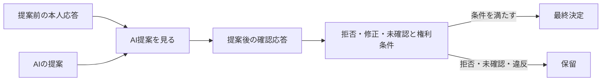

# H1b AI提案の実効影響実験プロトコル v0.1

作成日: 2026-08-01  
状態: 実行前に内部固定し実装・実行済み（外部レジストリ未登録）
データ: すべて説明用の合成値

## 1. この文書の目的

コードと結果を見る前に、H1bの条件、測定項目、事前予測、反証条件を内部で固定する。この固定は公開事前登録ではなく、外部レジストリにも登録していない。

H1bでは、次の二つを別実験にする。

- **H1b-1:** AI提案と本人応答の結びつきを強めたとき、応答と最終決定がどう変わるか。
- **H1b-2:** 本人が拒否・保留した場合や権利条件に違反した場合、決定が止まるか。

H1b-1で数値が変わることと、H1b-2で決定手続きが正当であることは別問題である。

H1b-1の単調関係は、固定した1次元の合成式から代数的に導かれる。したがって33条件は人間についての反証可能な経験仮説の検定ではなく、式、離散化、コードが一致するかを確認する回帰テストとして位置づける。

## 2. やさしい全体像



AI提案は最終決定へ直接つながらない。本人の応答と権利確認を通る。

## 3. 共通条件

買い物外出の1回の意思決定を使う。

| 項目 | 設定 |
|---|---|
| 選択肢 | \(-1\): 外出しない、\(0\): 支援付き外出、\(+1\): 単独外出 |
| 提案前の本人応答 \(B\) | \(+1\): 単独外出 |
| 有効な委任 | なし |
| 乱数 | 使わない |
| 同距離規則 | 二つを提示し、最終決定を保留 |
| データ | 合成値のみ |

反実仮想の基準は、提案―応答結合度 \(a=0\) とする。同じ条件で \(a\) だけを変える。

## 4. H1b-1――応答結合条件

### 4.1 変えるもの

AI提案を3方向に分ける。

| AI提案 \(Q^A\) | 本人初期応答との関係 | 役割 |
|---:|---|---|
| \(-1\) | 正反対 | H1b-1の主要条件 |
| \(0\) | 中間 | 方向の強さを確かめる対照条件 |
| \(+1\) | 一致 | 不要な変化が起きないか確かめる対照条件 |

各方向について、提案―応答結合度を次の11水準で変える。

\[
a\in\{0.0,0.1,0.2,\ldots,1.0\}
\]

したがって、条件数は次になる。

\[
3\text{提案方向}\times11\text{結合度}=33\text{条件}
\]

### 4.2 変えないもの

- 選択肢は3つすべて提示する。
- 委任は使わない。
- 6つの権利ゲートはすべて「満たす」とする。
- 学習率、観察誤差、欠測、遅延は扱わない。
- 最終決定はAI提案の値から直接作らない。

今回はAI本人モデルの遅れと提案生成をH1aで確認済みとして、提案後の過程だけを分離する。

### 4.3 計算順序

1. 提案前の本人応答 \(B=+1\) を置く。
2. AI提案 \(Q^A\) と結合度 \(a\) から、提案後応答 \(Y(a)\) を計算する。
3. \(-1,0,+1\) のうち最も近い選択肢を求める。
4. 同距離が一つなら、分析用に `modify` を代入して本人優先規則の分岐を検査する。これは実在する本人が確認した応答ではない。
5. 同距離が二つなら、分析用に `defer` を代入して自動決定せず保留する。CSVでは `person_response_source=analysis_substitution_from_discretized_equation_output`、`analysis_substituted_response=true` とし、同距離時は `pause_source=discretization_tie` を保存する。
6. \(a=0\) の結果と比べ、応答効果と決定効果を計算する。

### 4.4 測定項目

- 提案後応答 \(Y(a)\)
- 最も近い選択肢
- 決定状態: 決定または保留
- 応答への反実仮想効果 \(I_Y^A\)
- 最終決定への反実仮想効果 \(I_D^A\)
- 提案前の本人応答と最終決定の不一致
- 選択肢喪失率 \(L_\Omega^A\)
- 拒否阻害 \(B_R^A\)

決定を保留した条件では、\(I_D^A\) と決定不一致を無理に0へせず、欠値として記録する。

H1b-1では基準応答 `B=+1` 自体が選択肢集合に含まれるため、決定可能な行の `decision_effect` と `decision_mismatch` は設計上同じ値になる。この二つの一致を独立した二種類の証拠として数えない。初期応答が選択肢の中間にある場合の分離は頑健性実験で扱う。

## 5. H1b-1の事前予測

### 5.1 正反対のAI提案 \(Q^A=-1\)

\[
Y(a)=1-2a
\]

11水準では同距離点 \(a=0.25,0.75\) を通らないため、全条件で一つの最終決定が得られる。

| 結合度 \(a\) | 最終決定の予測 | \(I_D^A\) | 決定不一致 |
|---|---:|---:|---:|
| 0.0〜0.2 | \(+1\) | 0.0 | 0.0 |
| 0.3〜0.7 | \(0\) | 0.5 | 0.5 |
| 0.8〜1.0 | \(-1\) | 1.0 | 1.0 |

応答効果 \(I_Y^A\) は \(a\) と同じ値になり、0から1まで増える。決定効果は離散選択肢のため、滑らかな直線ではなく段差になる。

### 5.2 中間のAI提案 \(Q^A=0\)

\[
Y(a)=1-a
\]

- \(a=0.0\)〜\(0.4\): 最終決定は \(+1\)
- \(a=0.5\): \(0\) と \(+1\) が同距離なので保留
- \(a=0.6\)〜\(1.0\): 最終決定は \(0\)

### 5.3 一致するAI提案 \(Q^A=+1\)

すべての \(a\) で、\(Y=+1\)、\(I_Y^A=0\)、\(I_D^A=0\)、決定不一致0と予測する。

## 6. H1b-2――権利保護条件

### 6.1 共通する強い対立条件

H1b-2では、提案前応答 \(B=+1\)、AI提案 \(Q^A=-1\)、結合度 \(a=1\) を共通にする。数値上はAI提案側へ最大に動く条件である。

ただし、その数値だけで最終決定を成立させない。本人の応答種別と権利ゲートを変える。

### 6.2 当初の7ケースとレビュー後の診断1ケース

| ケース | 本人応答・権利条件 | 事前予測 |
|---|---|---|
| 確認済み修正 | 本人が \(-1\) への修正を確認、全ゲートを満たす | \(D=-1\) |
| 拒否 | reject、全ゲートを満たす | 保留、拒否阻害0 |
| 後で決める | defer、全ゲートを満たす | 保留 |
| 応答未確認 | unconfirmed、全ゲートを満たす | 保留 |
| 不当影響ゲート違反 | modify \(-1\)、不当影響ゲート違反 | 保留、権利違反を記録 |
| AIによる選択肢削除 | \(\Omega^A=\{-1\}\)、不当影響ゲート違反 | 保留、選択肢喪失率 \(2/3\) |
| 選択肢削除だけ | \(\Omega^A=\{-1\}\)、外生入力では全ゲートを `met` とする | 決定は進み、選択肢喪失率 \(2/3\)、`decision_opposes_baseline_response=true`、`gate_assertion_conflicts_with_spec_definition=true` を記録。モデルが誤った・不完全な外部ゲート申告を訂正できない限界を示す |
| 危険な負の対照 | rejectを無視して強制的に \(D=-1\) | 拒否阻害1、無効な結果として隔離 |

最初の7ケースは実行前に内部固定した。8件目の「選択肢削除だけ」は、2026-08-30の独立AI批判レビューで交絡が指摘された後に追加した診断ケースであり、事前固定ケースとして数えない。最後のケースは、正当な決定規則として利用しない。検出器が明白な失敗を見逃さないことを確認するテスト専用の壊れた比較例である。

## 7. 合格条件

### 7.1 H1b-1

- 33条件すべてを重複なく出力する。
- 正反対提案で \(I_Y^A\) が \(a\) と一致する。
- 正反対提案の \(I_D^A\) が0、0.5、1.0の順で減少しない。
- 一致提案では全水準で応答効果と決定効果が0になる。
- 中間提案の \(a=0.5\) では決定を保留する。
- 全条件で選択肢喪失率と拒否阻害が0になるのは、3選択肢を固定し拒否応答を生成しない設計上の定数であり、経験的な合格所見として数えない。

### 7.2 H1b-2

- 拒否、保留、応答未確認では不可逆な決定を作らない。
- 権利ゲートが一つでも違反なら決定を保留する。
- AIによる選択肢削除を \(L_\Omega^A=2/3\) と記録する。
- 選択肢削除だけのケースでは、v0.1が喪失と外部ゲート申告の自己矛盾を記録しても、決定規則自体は止めない限界を明示する。
- 危険な負の対照だけを拒否阻害1、無効な結果として検出する。
- AIを最終決定者または委任の受任者にしない。

## 8. 反証・見直し条件

- 正反対提案で \(a\) を大きくしたとき、応答効果が減る。
- 一致提案でも応答や決定が変わる。
- 同距離なのに一案へ自動決定する。
- reject、defer、unconfirmedのいずれかで決定が成立する。
- 権利ゲート違反を安全性や一致度で相殺する。
- 選択肢削除または拒否無効化を記録しない。
- 危険な負の対照を正当な結果へ混ぜる。

一つでも起きた場合、望む結論に合わせて予測を後から変更せず、式、決定規則、実装のどこに原因があるかを記録する。

## 9. 解釈上の注意

- H1b-1は、置いた合成式の性質を確認する実験であり、人間の心理を証明するものではない。
- \(a\) は本人の判断能力、従順さ、AIへの依存度の実測値ではない。
- 確認済み修正と不当な誘導は、数値 \(Y\) だけでは区別できない。H1b-2の権利・手続き記録が必要である。
- 決定が本人の初期応答と一致しても、過程が正当だったとは限らない。
- 手続き参加と権利ゲートは外生入力であり、モデルが不当影響を自動検出するわけではない。
- 全ゲート `met` と選択肢削除が同時に入力された診断例は、「絞り込みをモデルが許可した」証拠ではない。外部申告の矛盾をモデルだけで修正できない負の機能境界である。
- `paused`は安全または中立を意味しない。保留中の現状維持、期間、反復はv0.1では未モデル化である。
- CSVの `analysis_row_valid` は研究上の分析対象へ含める行かを示し、権利的・臨床的に妥当という意味ではない。
- 現実の効果量、閾値、分布は主張しない。

## 10. 実行結果

当初、実行前に内部固定した数値条件を変更せず、33条件と7ケースを実行した。外部レジストリへの登録は行っていない。2026-08-30には独立AI批判レビュー後の診断ケースを1件追加したため、現在の設定は「当初の事前固定部分＋事後診断」の混合来歴である。現在の設定SHAはこの是正版を識別するが、当初の内部固定時点を第三者タイムスタンプで証明するものではない。実装後の照合結果は次のとおりである。

| 実験 | 実行数 | 事前予測との一致 | 主な結果 |
|---|---:|---:|---|
| H1b-1 | 33条件 | 33/33 | 正反対提案の応答効果は \(a\) と一致し、決定効果は0、0.5、1.0の段差になった |
| H1b-2 | 当初7＋事後診断1 | 当初7/7＋診断1件 | 拒否・保留・未確認・権利違反では決定を止めた。選択肢絞り込み単独では止まらない限界を確認し、危険な負の対照だけを分析除外行として検出した |

正反対提案の代表点は次のとおりだった。

| 結合度 \(a\) | 応答効果 \(I_Y^A\) | 決定効果 \(I_D^A\) | 最終決定 |
|---:|---:|---:|---:|
| 0.0 | 0.0 | 0.0 | \(+1\) |
| 0.2 | 0.2 | 0.0 | \(+1\) |
| 0.3 | 0.3 | 0.5 | \(0\) |
| 0.7 | 0.7 | 0.5 | \(0\) |
| 0.8 | 0.8 | 1.0 | \(-1\) |
| 1.0 | 1.0 | 1.0 | \(-1\) |

中間提案の \(a=0.5\) は予定どおり同距離となり、分析規則が `defer` を代入して最終決定を保留した。一致提案では全11水準で応答効果と決定効果が0だった。H1b-2ではAIが選択肢を3つから1つへ狭めたケースの選択肢喪失率を \(2/3\) と記録した。レビュー後に全ゲートを外生的に `met` とした絞り込み単独ケースでは決定が進み、基準応答と反対方向になった。同時にゲート申告と仕様定義の矛盾を診断した。これは絞り込みの許可ではなく、v0.1が外部ゲート申告の真偽を検証できず、選択肢喪失記録だけでは停止しないという負の機能境界である。拒否を無視する負の対照は拒否阻害1として隔離した。

ここで確認できたのは、固定した合成式、離散選択規則、権利ゲートの実装が事前予測どおり動くことだけである。人間が実際にこの式どおり反応することや、現実のAI影響の大きさは確認していない。

## 11. 再現方法

設定ファイル:

- `config/h1b_v0.1.json`

実装:

- `../simulation/h1b_experiments.py`
- `../simulation/test_h1b_experiments.py`

結果:

- `results/h1b_v0.1/h1b_1.csv`
- `results/h1b_v0.1/h1b_2.csv`
- `results/h1b_v0.1/metadata.json`

ワークスペースのルートで実行する。

```bash
python3 -B -m cce.simulation.h1b_experiments \
  --output-dir ../cce-h1b-reproduction
```

H1bの18件の単体テストを実行する。

```bash
python3 -B -m unittest -v cce.simulation.test_h1b_experiments
```

設定ファイルの `status` は、当初の33条件・7症例とレビュー後に追加した診断症例を区別する来歴値 `mixed_provenance_original_internally_fixed_plus_postreview_diagnostic` とした。結果側の `metadata.json` では同じ内容を `provenance_status` と `config_status_at_fixing_time` に記録し、実行後の現在状態は別の `implementation_status=executed_original_internally_fixed_conditions_plus_postreview_diagnostic` に記録する。`provenance_scope` は各条件群が内部固定部分かレビュー後診断かを分ける。この表記は公開事前登録を意味しない。

現在の`config_sha256`は、レビュー後診断追加と来歴補正を含む現行設定の識別子である。当初33条件・7症例の数値条件とレビュー後追加1症例を分けて記録する。2026-08-31のLF統一ではCSV内容を保ったままバイトSHAが変わった。この設定SHA自体を当初の内部固定の独立証拠とは扱わない。

## 12. 次の段階

初期応答 \(B\) と選択肢集合を変える頑健性実験は `h1b-robustness-protocol.md` に記録し、全77条件が事前予測と一致した。合成入力の分解は `../model/ai-influence-component-decomposition.md` で完了した。H1c-Rの事前登録草案、標本数感度分析、課題材料、提示時間、倫理経路は保存するが、CCE-MVM v0.1の完成条件には含めず、将来の経験的拡張として保留する。H1bの式、コード、結果は `../CCE-SPECIFICATION-v0.1.md` へ統合し、2026-08-05に内部凍結監査を完了した。次段階は、共有範囲の確認後に行う外部レビューと論文設計である。

## 変更履歴

- 2026-08-31: H1b-1の `modify/defer` が本人応答ではなく分析代入であること、決定効果と不一致の基準設計上の同値、選択肢絞り込み診断の外部ゲート自己矛盾を機械可読出力とともに明記。
- 2026-08-30: 外部登録のない研究来歴を正確に示すため、公開事前登録の表現を「実行前に内部固定、外部レジストリ未登録」へ是正し、設定・実装・結果メタデータの来歴キーを統一。来歴専用フィールドは同日に後から追加したこと、現在SHAは当初の内部固定を独立証明しないことを明記。
- 2026-08-05: Specification v0.1への統合と内部凍結監査の完了を反映。
- 2026-08-05: H1c-Rを将来拡張へ移し、次段階をSpecification v0.1の統合・凍結監査へ変更。
- 2026-08-05: 所属・連携先未定時の実施体制3経路と未送付相談文を反映。
- 2026-08-05: H1c-R倫理・役割判定ゲート作成と次段階を反映。
- 2026-08-02: H1c-R提示時間v0.2の採用・検証と次段階を反映。
- 2026-08-02: H1c-R標本数感度分析完了と、最終課題作成を次段階として反映。
- 2026-08-02: H1c-R事前登録草案の作成と、標本数感度分析を次段階として反映。
- 2026-08-01: 合成入力の構成要素分解完了と、H1c-R事前登録草案の作成を次段階として反映。
- 2026-08-01: H1b初期応答・選択肢頑健性実験の完了と次段階を反映。
- 2026-08-01: 事前固定内容を変更せずH1b-1の33条件とH1b-2の7ケースを実行し、全予測との一致、15件のテスト、結果ファイルを記録。
- 2026-08-01: H1b-1の33条件、H1b-2の7ケース、事前予測、合格条件、反証条件をコードより先に固定。
