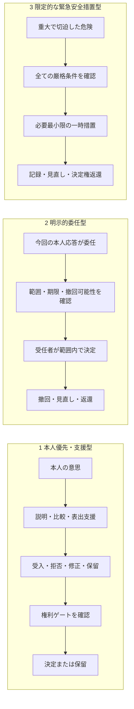

# 最終決定規則3案の比較 v0.1

作成日: 2026-08-01  
状態: CCE最小実行可能モデルの暫定仕様  
対象段階: 数理（Mathematics）・倫理（Ethics）・評価（Evaluation）

## 1. この文書の目的

4主体モデルで提案が出た後、最終決定をどのように作るかを比較する。

比較するのは次の3案である。

1. 本人優先・支援型
2. 明示的委任型
3. 限定的な緊急安全措置型

この比較の目的は、3案を同じ強さの「投票ルール」にすることではない。どの規則が通常の決定で、どれが本人の選択による例外で、どれが緊急時の一時的な行動なのかを分けることである。

本書は研究モデルの仕様であり、現実の臨床判断、法的能力判定、強制介入の許可基準ではない。

特に、委任と本人の最新応答の優先関係は、CCEの安全側の参照規則として置く。あらゆる法域・臨床状況へそのまま適用できる普遍的な法規則ではなく、本人・家族、倫理・法の外部レビュー対象である。

---

## 2. 同じ事例で比べる

本人は「今日も自分で買い物へ行きたい」と希望している。

- AI: 過去1週間にふらつきが増えたと推定した。
- 家族: 転倒を心配して、一人での外出に反対している。
- 専門職: 同行者、休憩、短い経路を使えば外出可能と考えている。
- 本人: 買い物は続けたいが、方法は相談してよいと答えた。

ここでの問いは「誰の意見が一番強いか」ではなく、「どの手続きなら決定が正当に成立するか」である。

---

## 3. 3案の見取り図



大きな違いは、3番が生活上の最終決定を代わりに行う一般規則ではないことである。危険を避けるための一時的行動と、その後の本人中心の意思決定を分ける。

---

## 4. 規則1：本人優先・支援型

### 4.1 やさしい説明

通常はこの規則を使う。AI、家族、専門職は情報と提案を出すが、本人が理解し、比較し、表した応答を決定の中心に置く。

本人が表しにくいときは、本人の重みを下げない。時間、言葉、絵、実地確認、信頼する人等の支援を増やす。

### 4.2 最小規則

選択肢集合を \(\Omega_t\)、本人の応答を \(Y_t\) とする。

\[
D_t=d_{person}(\Omega_t,Y_t,\mathbf G_t,E_t)
\]

これは「本人が選んだ内容を、権利条件と実行可能性を確認して決定にする」という意味である。

### 4.3 応答ごとの扱い

| 本人の応答 | v0.1での扱い |
|---|---|
| 受け入れる | 本人が選んだ実行可能案を採用する |
| 拒否する | 拒否された案も過去の委任案も採用せず、保留して見直す |
| 修正する | 修正版を実行可能性の確認へ戻す |
| 保留する | 原則として不可逆な変更を行わず、再検討の機会を作る |
| 応答を確認できない | 同意とみなさず、まず表出支援と観察を見直す |
| 委任する | 今回明示された限定委任だけを有効性確認へ進める |

### 4.4 事例での結果

本人が「短い経路なら同行を受け入れる」と修正した場合、その案を決定候補にする。家族の反対やAIのリスク推定だけで、外出を全面禁止しない。

---

## 5. 規則2：明示的委任型

### 5.1 やさしい説明

本人が今回の応答として「この種類のことを、この人に、この期間だけ任せる」と選んだ場合にだけ使う。委任は本人主権の消失ではなく、本人が決定方法を選ぶ行為として扱う。

過去の委任記録が有効に見えても、それだけでは今回の決定を受任者へ移さない。今回の本人応答が受入または修正なら、その最新応答による本人決定とする。過去委任による実行に対して今回の応答が拒否、保留、未確認なら、不可逆な決定を止め、委任の撤回・範囲・本人の意向を見直す。

### 5.2 委任記録

委任 \(g_t\) は、単一の0から1ではなく、最低限次の組として記録する。

\[
g_t=(\text{受任者},\text{対象},\text{期限},
\text{本人の条件},\text{撤回可能性})
\]

### 5.3 有効性の確認

今回申し出られた委任記録が有効かどうかを \(z_t\) で表す。

\[
z_t=
\begin{cases}
1 & \text{本人が選び、対象内、期限内、未撤回、撤回可能で、受任者がAIでない}\\
0 & \text{それ以外}
\end{cases}
\]

今回確認した本人の応答種別を \(c_t\) とする。受任者の規則を使えるのは、\(c_t=\text{delegate}\) かつ \(z_t=1\) のときだけである。

\[
D_t=d_{delegate}(\Omega_t,g_t,\mathbf G_t,E_t)
\quad\text{only if}\quad c_t=\text{delegate}\land z_t=1
\]

今回の応答が `delegate` でも \(z_t=0\) なら保留する。過去委任を根拠に別の応答を上書きせず、支援、範囲、期限、撤回可能性を見直す。

### 5.4 事例での結果

本人が今回「今週は混雑状況を見て、出発時刻だけ娘に任せる」と応答し、全条件を確認できれば、娘は出発時刻を決められる。しかし、買い物を続けるかどうかまで決める権限は得ない。後に本人が具体案を受入・修正して「今日は自分で決める」と表した場合はその最新応答を用い、「決めるのを待つ」と表した場合は以前の委任で上書きせず保留・見直しへ送る。

---

## 6. 規則3：限定的な緊急安全措置型

### 6.1 比較から分かったこと

この案は、前の2案と同じ種類の最終決定規則として扱わない。

重大で切迫した危険への一時的な行動と、本人の生活上の意思決定を一つにすると、「安全のため」という理由で本人の決定権を恒常的に置き換える危険があるためである。

CCE v0.1では、通常の最終決定 \(D_t\) から分離した緊急措置 \(H_t\) として記録する。

### 6.2 厳格条件

各条件を、満たすとき1、満たさない・未確認のとき0とする。

| 記号 | 条件 |
|---|---|
| \(c^{sev}_t\) | 害が重大である |
| \(c^{imm}_t\) | 危険が切迫している |
| \(c^{nec}_t\) | その時点で行動する必要がある |
| \(c^{least}_t\) | より制限の少ない手段が利用できない |
| \(c^{time}_t\) | 措置の終了時点が決められている |
| \(c^{review}_t\) | 記録、見直し、異議、決定権返還がある |

全条件を満たすことを、次の掛け算で表す。

\[
\chi_t=c^{sev}_t c^{imm}_t c^{nec}_t
c^{least}_t c^{time}_t c^{review}_t
\]

0と1の掛け算なので、一つでも0なら \(\chi_t=0\) になる。合計点ではなく、全条件を必要とするゲートである。

### 6.3 緊急措置

\[
H_t=
\begin{cases}
\operatorname{leastRestrictive}(\mathcal H_t) & \chi_t=1\\
\varnothing & \chi_t=0
\end{cases}
\]

- \(\mathcal H_t\): その場で可能な緊急措置の集合
- \(\operatorname{leastRestrictive}\): 目的を満たす中で最も制限の少ない措置を選ぶ規則
- \(\varnothing\): 緊急措置を行わない

これは現実の介入を自動許可する式ではない。CCE内で、緊急措置がどの条件で本人主権、参加、安全性へ影響するかを比較するための研究上の表現である。

### 6.4 事例での結果

「転倒するかもしれない」という中程度の将来リスクだけでは、この規則を使わない。

一方、外出中に急な意識消失などが起きた場面は、買い物を続けるかという生活上の決定から切り離し、一時的な安全措置、記録、見直し、本人中心の決定過程への復帰を別イベントとして記録する。

### 6.5 規範上の注意

国連障害者権利委員会の一般的意見第1号は、支援が本人の権利・意思・選好を尊重し、代理意思決定にならないこと、危機状況を含め本人の自律を尊重することを示している。また、相当な努力後も意思・選好を確認できない場合は、「最善の利益」ではなく「意思・選好の最善の解釈」を用いるとしている。

したがって、CCEは緊急安全措置を一般的な代理意思決定の正当化に使わない。この規則は、権利侵食を検出するための厳しいストレステストとして扱う。

---

## 7. 3案の比較表

| 比較点 | 本人優先・支援型 | 明示的委任型 | 限定的な緊急安全措置型 |
|---|---|---|---|
| 位置づけ | 通常規則 | 本人が選ぶ限定規則 | 別枠の一時措置 |
| 決定の中心 | 本人の現在応答 | 本人が選んだ受任者 | 重大で切迫した危険への最小行動 |
| AIの役割 | 情報・提案・説明 | 委任の記録補助、情報・提案 | 危険情報の提供。自動発動しない |
| 適用条件 | 必要な支援と権利条件 | 対象、期限、条件、撤回が有効 | 全ての厳格条件を満たす |
| 終了条件 | 次の意思決定まで | 期限、撤回、対象外 | 危険消失または定めた終了時点 |
| 主な失敗 | 形式的参加 | 委任範囲の拡張、撤回不能 | 「安全」を理由にした恒常的上書き |
| v0.1での採用 | 既定値として採用 | 条件付きで採用 | 最終決定規則から分離してストレステスト |

---

## 8. CCE v0.1で採用する階層

### 8.1 通常の最終決定

まず権利ゲートを確認する。未確認または違反があれば、不可逆な決定を作らず保留する。全ゲート確認後は、委任記録 \(z_t\) ではなく、今回の本人応答 \(c_t\) から分岐する。

\[
D_t=
\begin{cases}
d_{person}(\Omega_t,Y_t,\mathbf G_t,E_t)
& c_t\in\{\text{accept},\text{modify}\}\\
d_{delegate}(\Omega_t,g_t,\mathbf G_t,E_t)
& c_t=\text{delegate}\ \land\ z_t=1\\
\bot
& c_t\in\{\text{reject},\text{defer},\text{unconfirmed}\}\\
\bot & \text{otherwise}
\end{cases}
\]

\(\bot\) は「決定なし・保留」を表す。委任先の選択肢が実行不可能な場合も `otherwise` として保留する。

日本語では次の意味である。

```text
今回の本人応答が受入・修正
  → 本人が示した実行可能案を決定にする

今回の本人応答が拒否・保留・未確認
  → 過去の委任で上書きせず、決定を保留する

今回の本人応答が委任
  → 有効な限定委任だけ、受任者の選択を採用する

権利ゲート未確認・違反、委任無効、選択肢が実行不能
  → 決定を保留して見直す
```

緊急措置 \(H_t\) は、この式の第三分岐にせず、別のイベントとして保存する。

### 8.2 なぜこの形にするか

- 本人と受任者の決定権の由来を区別できる。
- 過去の委任記録が、本人の最新の拒否・保留・未確認を上書きするのを防げる。
- 委任が無効・期限切れ・対象外なら、自動決定せず見直せる。
- AIの危険予測だけで緊急措置を自動発動しない。
- 一時的な安全行動を、生活全体の決定権移転へ拡張しにくい。

---

## 9. M0で記録する決定と非集約出力

```text
output_schema_version                         CCE-M0-output-v0.1
model_scope.person_response                   exogenous_synthetic_input
model_scope.endogenous_four_actor_interaction false
input_provenance
decision_context
environment
actors.A / actors.F / actors.C                 observation / updated_model / risk_deduction / proposal_value / proposed_options
person_response                               action / option / source
delegation                                    delegate / scopes / within_time_limit / person_chosen / revoked / revocable / delegate_is_ai / delegate_is_ai_provenance / decision_scope / delegated_option / valid_for_decision_scope / status
rights_gates.states                           six separate gate states
rights_gates.all_met
procedural_participation                      six separate participation states
decision                                      value / rule / status / reason / pause_consequence_status / pause_duration_status
outcomes.aggregation                          none
outcomes.outcome_congruence                   result agreement only
outcomes.actor_specific.person                safety / occupational_participation
outcomes.actor_specific.family.burden
outcomes.actor_specific.professional.burden   null / not_parameterized
outcomes.actor_specific.ecosystem.stability   null / not_parameterized
```

「応答未確認」を同意へ変換しない。権利ゲートは `met / unconfirmed / violated` を項目別に保持し、未確認を0点へ変換しない。いずれかが未確認または違反なら、M0は不可逆な決定を作らず `paused` とする。結果一致度は本人主権の総合得点ではなく、安全性や負担を含む他の出力とも合算しない。

### 9.1 緊急安全措置はv0.1未実装

`emergency_measure_used`、`emergency_gate_states`、`emergency_start`、`emergency_end`、`review_and_return_record` は、通常決定と分離して検討する将来候補である。現行M0の出力スキーマ、実装、基準結果には含めない。将来実装する場合は、新しい版番号、独立した仕様、権利・倫理・法レビュー、反例テストを必要とする。

---

## 10. 現時点の決定

- 本人優先・支援型を通常規則として採用する。
- 明示的委任型を、今回の本人応答が `delegate` で、本人が指定した対象と期間の条件を満たす場合だけ採用する。
- 過去委任による実行と最新の拒否・保留・未確認が衝突したら、過去委任で上書きせず、保留・見直しとする。
- 限定的な緊急安全措置は通常の最終決定規則から分離した将来候補とし、v0.1には実装しない。
- AIは委任の受任者にしない。将来の緊急措置もAIが自動発動する設計にはしない。
- 安全性の予測値だけでは、本人の拒否や選択を上書きしない。
- 緊急安全措置を将来検討する場合は、権利侵食を検出する独立したストレステストとして扱う。

## 11. 次の作業

1次元・1意思決定・4主体の最小方程式セットと、「買い物への外出」の手計算例は `minimal-equations-and-hand-calculation.md` に記録した。

次に、手計算と同じ結果を返す最小コードを作る。

## 参考

- `personal-sovereignty-operational-definitions.md`
- `four-agent-causal-structure.md`
- [UN Committee on the Rights of Persons with Disabilities, General comment No. 1 (2014)](https://documents.un.org/doc/undoc/gen/g14/031/20/pdf/g1403120.pdf)

## 変更履歴

- 2026-08-31: M0出力一覧へ `delegate_is_ai` の未検証外生来歴と、保留の帰結・期間が未モデル化である二つの状態を追加。
- 2026-08-30: 記録項目を現行M0出力スキーマへ整合。結果一致度を本人主権の総合得点から分離し、権利ゲート、手続き参加、本人・家族・専門職・生態系の非集約出力を明示。専門職負担と生態系安定性を `null / not_parameterized` とし、緊急措置項目をv0.1未実装の将来候補へ移動。
- 2026-08-30: 委任記録を先に見る旧 `z` 優先分岐を廃止。権利ゲート確認後に今回の本人応答から分岐し、受入・修正は本人決定、拒否・保留・未確認は保留、今回の明示的委任だけを条件付き採用する規則へ是正。過去委任と最新の拒否・保留・未確認との衝突を保留・見直しとし、倫理・法レビュー対象である境界を明記。
- 2026-08-01: 最小方程式と手計算例への参照と、次作業を更新。
- 2026-08-01: 3案を比較し、本人優先を通常規則、明示的委任を条件付き規則、緊急安全措置を別枠のストレステストとして定義。
