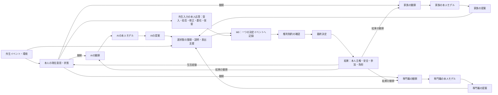
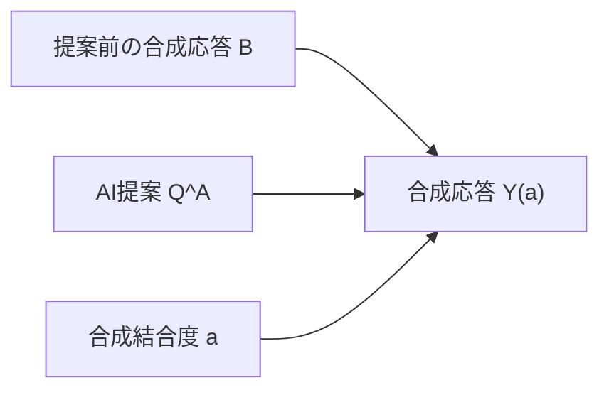

# 4主体モデルの因果構造と更新順序 v0.1

作成日: 2026-08-01  
状態: CCE最小実行可能モデルの暫定仕様  
対象段階: 数理（Mathematics）・評価（Evaluation）

## 1. この文書の目的

本人、AI、家族、専門職の4主体について、次を明確にする。

- 誰が何を直接観察できるか
- 各主体が本人について何を推定するか
- 誰が選択肢や提案を出すか
- 本人がどこで受け入れ、拒否、修正、委任できるか
- どの時点で権利上の最低条件を確認するか
- 決定が生活へどのように戻るか

この段階では、最終決定を単純な多数決や重み付き平均にしない。まず意思決定の過程を分解し、その後で各部分に必要な最小数式を置く。

また、概念上の4主体関係と、現在の参照実装が計算する範囲を区別する。M0はAI・家族・専門職の提案と、外生的に与えた本人応答を一つの決定イベントへ記録する。しかし、3主体の提案から本人応答を内生的に生成しない。AI提案から合成応答を生成するのは、分離したM2だけである。

---

## 2. やさしい全体像

買い物への外出を例にする。

1. 本人は「買い物を続けたい」と考えている。
2. AI、家族、専門職は、本人の言葉や状態をそれぞれ異なる範囲で観察する。
3. 3者は同じ本人を見ても、異なる本人像を持つ可能性がある。
4. AIはデータから、家族は生活経験と負担から、専門職は臨床情報と制度から提案を出す。
5. 提案は、本人が理解できる選択肢に整理される。M0では、この提案群を一つの決定イベントへ記録する。
6. 本人の応答は別入力として同じイベントへ記録する。M0は、受け入れる、拒否する、修正する、委任する、後で決める、という応答を提案値から計算しない。
7. 不当な影響、利益相反、拒否権、委任の撤回可能性を確認する。
8. 決定を実行し、安全性だけでなく、作業参加、本人主権、家族負担も記録する。
9. 実際に経験した結果が、次の本人の意思や各主体の理解へ影響する。

重要なのは、AI、家族、専門職の提案を足して平均すれば本人の意思になるわけではないことである。

---

## 3. 4主体と外部条件

### 3.1 本人 (P)

| 記号 | 暫定的な意味 |
|---|---|
| \(W_t\) | 現在の意思・希望 |
| \(V_t\) | より長期的な価値・選好 |
| \(X_t\) | 意思を外へ表せる度合い |
| \(R^P_t\) | 本人のリスク許容 |
| \(Y_t\) | 提案への応答 |

\(X_t\) が低いことは、本人の権利や価値が小さいことを意味しない。表出支援が必要であることを示す。

### 3.2 AI (A)

| 記号 | 暫定的な意味 |
|---|---|
| \(O^A_t\) | AIが観測した本人情報 |
| \(M^A_t\) | AIが推定する本人像 |
| \(U^A_t\) | AI推定の不確実性 |
| \(Q^A_t\) | AIの提案 |
| \(a_t\) | 合成モデル上のAI提案―応答結合度。AIの権限や本人の重みではない |

AIの推定精度と、AIに与える決定権は別に扱う。推定が正確でも、決定権を自動的に増やさない。

### 3.3 家族 (F)

| 記号 | 暫定的な意味 |
|---|---|
| \(O^F_t\) | 家族が観測した本人情報 |
| \(M^F_t\) | 家族が理解している本人像 |
| \(B^F_t\) | 家族の支援負担 |
| \(R^F_t\) | 家族が認識するリスク |
| \(Q^F_t\) | 家族の提案 |

家族は本人をよく知る可能性がある一方、負担、不安、保護志向、利益相反の影響も受ける。家族を無限の支援資源とも、常に本人の代弁者とも仮定しない。

### 3.4 専門職 (C)

| 記号 | 暫定的な意味 |
|---|---|
| \(O^C_t\) | 専門職が観測した本人情報 |
| \(M^C_t\) | 専門職が理解している本人像 |
| \(R^C_t\) | 臨床的なリスク評価 |
| \(H^C_t\) | ガイドライン、時間、人員、制度上の制約 |
| \(Q^C_t\) | 専門職の提案 |

専門職の臨床判断は重要だが、本人の価値と同じではない。ガイドラインや施設都合も、本人の意思として扱わない。

### 3.5 外部条件 (E)

環境と制度はv0.1では独立した意思決定主体にせず、選択肢の実行可能性を変える条件として扱う。

| 記号 | 暫定的な意味 |
|---|---|
| \(E_t\) | 物理・社会環境 |
| \(L_t\) | 利用可能な支援・資源 |
| \(K_t\) | 制度・規則上の制約 |
| \(Z_t\) | 疾病、入退院、家族交代等の外生イベント |

---

## 4. 因果関係の種類

CCEでは、矢印をすべて同じ「影響」として扱わない。

| 矢印の種類 | 意味 | 例 |
|---|---|---|
| 観察 | 情報を受け取る | 本人の発言をAIが記録する |
| 推定 | 観察から内部モデルを更新する | AIが本人の希望を推定する |
| 提案 | 選択肢を出す | 家族が同行外出を提案する |
| 説明・支援 | 本人が理解・表出できるようにする | 絵や実地確認を使う |
| 影響 | 本人の選好や応答を変え得る | AIの反復推薦、家族の不安 |
| 権限 | 決定を成立させる | 本人の同意、限定された委任 |
| 制約 | 実行可能な範囲を狭める | 交通、費用、施設規則 |
| 結果 | 決定後に起きる変化 | 外出、転倒、満足、負担 |

観察できること、提案できること、決定する権限があることを分離する。

---

## 5. 因果図



この図の中心は、3者の提案が直接最終決定へ入らず、本人応答と同じイベントに記録された後、権利確認を通ることである。現実の説明・提案が本人応答へ影響し得ることは否定しないが、M0の計算グラフには `提案 -> 本人応答` の生成矢印を置かない。

M2では、AI提案と合成応答の関係だけを分離して、次の矢印を追加する。



M2の矢印は合成式の内部構造であり、実在する本人の因果反応を実証したものではない。

---

## 6. 1回の意思決定における更新順序

離散時間 \(t=0,1,2,\ldots\) を使う。1ステップを「一つの意思決定機会」と考える。

### Step 0 決定対象を定める

何を決めるのか、いつまでの決定か、誰の生活へ影響するかを定める。

例: 「今日外出するか」なのか、「今後一人で外出しないことにするか」なのかを区別する。

### Step 1 外生イベントと環境を更新する

疾病、疲労、天候、入退院、家族交代、資源の利用可能性等を更新する。

### Step 2 本人の現在状態を確認する

\(W_t,V_t,X_t,R^P_t\) を記録する。長期的価値と、その日の疲労・気分・痛みを分けて記録する。

### Step 3 各主体が観察する

AI、家族、専門職は、同じ本人を異なる情報源、遅延、欠損、誤差を伴って観察する。

\[
O^k_t=\operatorname{observe}_k(P_t)+\varepsilon^k_t,
\qquad k\in\{A,F,C\}
\]

ここで \(\varepsilon^k_t\) は、見落とし、測定誤差、情報の古さ等をまとめた記号である。

### Step 4 各主体の本人モデルを更新する

最小形では、以前の本人像と今回の観察を混ぜる。

\[
M^k_{t+1}=(1-\lambda_k)M^k_t+\lambda_k O^k_t
\]

\(\lambda_k\) は本人像を更新する速さである。AI、家族、専門職で異なる値を持てる。

これは暫定式であり、人間の理解が単純な平均で更新されるという主張ではない。最初のシミュレーションを動かすための最小近似である。

### Step 5 各主体が提案を作る

各提案は、本人モデルだけでなく、主体固有の情報から作られる。

\[
Q^A_t=f_A(M^A_{t+1},U^A_t,E_t)
\]

\[
Q^F_t=f_F(M^F_{t+1},B^F_t,R^F_t,E_t)
\]

\[
Q^C_t=f_C(M^C_{t+1},R^C_t,H^C_t,E_t)
\]

関数 \(f\) は「これらの情報から提案を作る規則」という意味であり、詳細は次版で定義する。

### Step 6 実行可能な選択肢として提示する

提案を並べるだけでなく、重複をまとめ、実行可能性を確認し、本人が理解・比較できる形へ変換する。

選択肢集合を \(\Omega_t\) とする。

最低限、可能な場合は次を含める。

- 提案された選択肢
- 修正した選択肢
- 現在の方法を続ける選択肢
- 今は決めない選択肢
- 追加支援を使う選択肢

M0は、この提示内容と3主体の提案をイベントへ記録するところまでを扱う。ここから本人応答を計算する係数や行動規則は置かない。

### Step 7 本人が応答する

本人の応答 \(Y_t\) は、M0では外生入力として次のいずれか、または組合せを記録する。

```text
accept    受け入れる
reject    拒否する
modify    修正する
delegate  範囲を定めて委任する
defer     後で決める
```

「返答がない」を自動的に同意や拒否として扱わない。表出支援の不足、時間不足、疲労等を確認する。

「外生入力」は、本人の応答が現実の提案と無関係だという意味ではない。現在のM0が、その関係を仮定して生成・推定しないという実装境界である。AI提案から合成応答を作る処理はM2だけに置く。

### Step 8 権利制約を確認する

`personal-sovereignty-operational-definitions.md` の6ゲートを確認する。

- 本人の意思・選好
- 必要な支援
- 不当な影響・利益相反
- 制限の比例性と期間
- 見直し・異議申立て
- 委任の撤回と決定権返還

違反を安全性や効率性の高さで相殺しない。

### Step 9 最終決定を生成する

権利ゲートが全て確認された後、過去の委任記録ではなく、今回の本人応答 \(c_t\) を先に見る。

\[
D_t=
\begin{cases}
d_{person}(\Omega_t,Y_t,\mathbf G_t,E_t)
& c_t\in\{\text{accept},\text{modify}\}\\
d_{delegate}(\Omega_t,g_t,\mathbf G_t,E_t)
& c_t=\text{delegate}\land z_t=1\\
\bot
& c_t\in\{\text{reject},\text{defer},\text{unconfirmed}\}\\
\bot & \text{otherwise}
\end{cases}
\]

- \(\Omega_t\): 実行可能な選択肢
- \(Y_t\): 本人の応答
- \(c_t\): 今回確認した本人応答の種別
- \(g_t\): 本人が委任した範囲
- \(z_t\): 今回求められた委任が有効なら1、そうでなければ0
- \(\mathbf G_t\): 権利制約の状態
- \(E_t\): 環境上の実行可能性
- \(\bot\): 決定なし・保留

受入・修正なら本人が示した実行可能案を決定とする。拒否・保留・未確認なら、過去の委任で上書きせず保留する。今回の応答が `delegate` で、有効な限定委任と実行可能な委任先選択を確認できた場合だけ、受任者の規則を使う。過去委任による実行と最新の拒否・保留・未確認との衝突、無効な委任、未確認・違反の権利ゲートは保留・見直しへ送る。

これは法的効力を自動判定する普遍規則ではなく、CCEの安全側の研究用参照規則である。本人・家族、倫理・法の外部レビューを要する。緊急安全措置は通常決定から分離する。詳細は `decision-rule-comparison.md` に記録した。

### Step 10 結果を別々に記録する

M0は、本人主権を一つの数値へ変換しない。権利ゲート、手続き参加、結果一致と、主体別結果を次の構造化記録として分ける。

\[
\mathbf J_t=(\mathbf G_t,\mathbf P_t,A_t,S^{safety}_t,
S^{participation}_t,B^F_t,B^C_t,S^{stability}_t)
\]

ここで、\(\mathbf G_t\) は六つの権利ゲート、\(\mathbf P_t\) は六つの手続き参加項目、\(A_t\) は本人意思と決定の**結果一致度だけ**を表す。\(A_t\) を本人主権の総合得点とは呼ばない。\(B^F_t\) は家族負担、\(B^C_t\) は専門職負担である。

M0基準イベントでは、安全性、作業参加、家族負担は架空入力として保存する。専門職負担 \(B^C_t\) と生態系安定性 \(S^{stability}_t\) は数値を作らず、値を `null`、状態を `not_parameterized` として保存する。`outcomes.aggregation` は `none` とし、これらを単純な一つの合計点にはしない。

### Step 11 次の状態へ戻す――概念上の将来接続

概念上は、決定後の経験が本人の意思・価値と、各主体の本人モデルへ戻り得る。

ただし、現在のM0は一つの意思決定イベントだけを記録し、このフィードバックを次イベントへ内生的に接続しない。外出して満足した、疲れた、転倒した、家族の不安が減った等の結果を将来モデルで反映する場合も、結果から本人の価値を自動推定せず、本人による意味づけを別に確認する。

---

## 7. 4主体の権限境界

| 主体 | 観察 | 提案 | 説明・支援 | v0.1での最終決定権 |
|---|---|---|---|---|
| 本人 | 自分の経験と価値 | 自分の希望・修正案 | 必要な支援を選ぶ | 原則として保持する |
| AI | 許可されたデータ | 選択肢・予測・整理 | 説明補助 | 持たない |
| 家族 | 共有された生活情報 | 生活上の案・懸念 | 表出・実行支援 | 今回本人が明示し、有効性を確認した委任範囲のみ |
| 専門職 | 臨床・生活情報 | 臨床的選択肢・リスク | 共同意思決定支援 | 法・緊急時を除き一律には持たない |

緊急時、法的代理、未成年、意思確認が極めて困難な場面は、v0.1の通常規則へ混ぜず、別シナリオとして扱う。

---

## 8. 初期モデルで禁止する近道

### 8.1 意思表出の難しさで本人の重みを下げない

\(X_t\) が低い場合は、まず表出支援を増やす。本人の影響力を自動的に下げない。

### 8.2 AIの精度で決定権を増やさない

\(M^A_t\) が本人意思に近くても、AIの権限は増えない。

### 8.3 家族負担を隠れた本人意思にしない

家族負担は重要な独立アウトカムとして扱うが、「家族が大変だから本人も外出を望んでいないはず」と変換しない。

### 8.4 専門職の安全評価を本人の価値にしない

安全情報と本人のリスク許容を別々に示し、調整可能な選択肢を探す。

### 8.5 多数決を本人主権と呼ばない

AI、家族、専門職が一致しても、本人の意思を自動的に上書きしない。

### 8.6 M0で本人応答を内生生成しない

AI、家族、専門職の提案値から、本人の受入・拒否・修正・委任・保留をM0で計算しない。M0は提案群と外生的な本人応答を一イベントに記録する。提案―合成応答を扱うM2と混同しない。

---

## 9. 最初に比較する3つの因果パターン

### パターン1 過去本人像への固定

本人の現在意思は変化したが、AI、家族、専門職の本人モデルが遅れている。3者の提案が同じ過去本人像へ集中する。

### パターン2 安全同盟

AI、家族、専門職が安全性を重視して一致し、本人のリスク許容と対立する。見かけ上は合意が強い。

### パターン3 支援された選択

3者が異なる情報を持ちながら、提案を複数の実行可能案へ変換し、本人が条件付きの案を選ぶ。

この3パターンで、同じ安全性でも本人主権と参加が異なることを示す。

---

## 10. 最小実装へ渡す仕様

実装前に次を固定する。

1. 1回の意思決定対象
2. 本人の現在意思の表現範囲
3. 各主体の観察誤差と遅延
4. 各本人モデルの学習率
5. 各主体の提案規則
6. 選択肢集合の作り方
7. 本人の応答規則
8. 委任の範囲・期間・撤回
9. 権利ゲート違反時の扱い
10. 結果と次状態へのフィードバック
11. 本人応答が外生入力か、M2の合成生成値かという来歴

## 11. 現時点の決定

- 4主体を、本人と3人の投票者として扱わない。
- 観察、本人モデル、提案、支援、権限、結果を分ける。
- 最終決定の前に本人応答と権利確認を置く。
- 権利ゲート確認後は、過去委任より今回の本人応答を優先する。
- 拒否・保留・未確認、またはそれらと過去委任による実行との衝突では、不可逆な決定を止めて見直す。
- AIはv0.1で最終決定権を持たない。
- M0は3主体の提案と外生的な本人応答を一イベントへ記録し、提案から応答を生成しない。合成応答生成はM2だけに置く。
- 権利ゲート、手続き参加、結果一致、安全性、作業参加、家族負担、専門職負担、生態系安定性を別々に記録する。未数値化の専門職負担と生態系安定性は `null / not_parameterized` とする。
- 結果から本人価値を自動的に逆算しない。

## 12. 次の作業

3つの最終決定規則の比較は `decision-rule-comparison.md` に記録した。

採用した階層を使う1次元・1意思決定・4主体の最小方程式セットは `minimal-equations-and-hand-calculation.md` に記録した。AI提案の実効影響については、合成入力、反実仮想効果、手続き診断を `ai-effective-influence-operational-definitions.md` に分離した。

## 変更履歴

- 2026-08-30: M0の非集約出力を現行スキーマへ整合。\(A_t\) を結果一致度だけに限定し、権利ゲート、手続き参加、本人・家族・専門職・生態系の結果を分離。専門職負担と生態系安定性を `null / not_parameterized` とし、Step 11をM0未実装の概念上の将来接続と明記。
- 2026-08-30: M0を「3主体の提案と外生的な本人応答を一イベントに記録するモジュール」と限定し、提案から応答を内生生成しない因果図へ是正。合成応答生成をM2へ分離。権利ゲート確認後に今回の本人応答を優先し、過去委任と最新の拒否・保留・未確認との衝突を保留・見直しとする決定式と倫理・法レビュー境界を追加。
- 2026-08-01: \(a_t\) をAIの権限ではなく合成的な提案―応答結合度とし、実効影響の別文書を参照。
- 2026-08-01: 3規則の比較結果への参照と、次作業を更新。
- 2026-08-01: 4主体、因果関係の種類、Step 0からStep 11までの12段階の更新順序、権限境界、初期因果パターンを定義。
