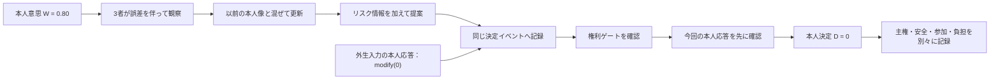

# CCE最小方程式と手計算例 v0.1

作成日: 2026-08-01  
状態: CCE-MVM v0.1の固定手計算例  
対象段階: 数理（Mathematics）・最小実装前の手計算

## 1. この文書の目的

CCEの最小モデルを、コードを書く前に手計算で最後まで動かす。

扱うのは一つの意思決定だけである。

> 本人が今日、どの方法で買い物へ行くか。

数値はすべて仕組みを理解するための架空値であり、臨床的な基準、実測値、危険度の閾値ではない。

---

## 2. 今回の選択肢

外出方法を1本の数直線へ置く。

| 値 | 選択肢 | この例での意味 |
|---:|---|---|
| \(-1\) | 外出しない | 買い物を延期する |
| \(0\) | 支援付き外出 | 同行、短い経路、休憩を使う |
| \(+1\) | 単独外出 | いつもの方法で一人で行く |

したがって、選択肢集合は次になる。

\[
\Omega=\{-1,0,1\}
\]

この1次元化は、「外出しない」から「単独外出」までの自立性・危険への曝露を単純化したものである。人の価値全体を1本の物差しで表せるという意味ではない。

---

## 3. 全体の流れ



最終決定 \(D\) は3者の提案の平均ではない。提案は本人が比較するための情報として使う。

ただし、CCE-MVMのM0は、提案を入力として本人応答を計算するモデルではない。この手計算では、AI・家族・専門職の提案と、別に与えた本人応答を**一つの決定イベントへ記録**する。現実には説明や提案が応答へ影響し得るが、M0はその因果効果を仮定せず、本人応答を外生的な合成入力として受け取る。AI提案から合成応答を生成する式はM2だけで扱う。

---

## 4. 最低限使う記号

時間は1回だけなので、読みやすさのため添字 \(t\) を省略する。

| 記号 | やさしい意味 |
|---|---|
| \(W\) | 本人が今回表した現在意思 |
| \(O^k\) | 主体 \(k\) が観察した本人情報 |
| \(M^k_{old}\) | その主体が以前から持っていた本人像 |
| \(M^k_{new}\) | 今回の観察後に更新された本人像 |
| \(\lambda_k\) | 新しい観察を取り入れる割合 |
| \(r_k\) | その主体が見積もった安全上のリスク |
| \(\beta_k\) | その主体が提案でリスクを重く見る度合い |
| \(Q^k\) | その主体の連続的な提案値 |
| \(\pi(Q^k)\) | 提案値に最も近い実行可能な選択肢 |
| \(Y\) | 本人の応答 |
| \(c\) | 今回確認した本人の応答種別 |
| \(z\) | 今回本人が求めた委任が有効なら1、そうでなければ0 |
| \(D\) | 最終決定 |

ここで \(k\in\{A,F,C\}\) とする。\(A\) はAI、\(F\) は家族、\(C\) は専門職である。

---

## 5. 最小方程式セット

### 式1 観察

\[
O^k=\operatorname{clip}(W+\varepsilon_k,-1,1)
\]

- \(\varepsilon_k\): 見落とし、解釈の違い、情報の古さ等を表す観察誤差
- \(\operatorname{clip}\): 値が範囲外へ出たら、\(-1\) または \(+1\) で止める操作

日本語では、「本人意思に観察のずれが加わったものを、その主体が見た情報とする」という意味である。

### 式2 本人モデルの更新

\[
M^k_{new}=(1-\lambda_k)M^k_{old}+\lambda_k O^k
\]

日本語では、「以前の本人像と今回の観察を混ぜる」という意味である。

- \(\lambda_k=0\): 今回の観察を全く取り入れない
- \(\lambda_k=1\): 以前の本人像を使わず、今回の観察だけを使う
- \(\lambda_k=0.5\): 半分ずつ混ぜる

### 式3 提案値

\[
Q^k=\operatorname{clip}(M^k_{new}-\beta_k r_k,-1,1)
\]

日本語では、「更新した本人像から、その主体が重視するリスク分を差し引いて提案を作る」という意味である。

この式は、主体が実際にこのように考えるという心理学的主張ではない。本人像と安全評価を混同せずに保存しながら、最初のシミュレーションを動かすための暫定近似である。

### 式4 実行可能な選択肢への変換

\[
\pi(Q^k)=\underset{\omega\in\Omega}{\operatorname{argmin}}
\left|Q^k-\omega\right|
\]

難しく見えるが、意味は次の一文だけである。

> \(-1,0,1\) の中から、提案値 \(Q^k\) に最も近いものを選ぶ。

同じ距離の選択肢が二つある場合は、自動決定せず、本人へ両方を提示する。

### 式5 通常の最終決定

権利ゲートが全て確認された後、委任記録ではなく今回の本人応答 \(c\) から先に分岐する。

\[
D=
\begin{cases}
d_{person}(\Omega,Y,\mathbf G,E)
& c\in\{\text{accept},\text{modify}\}\\
d_{delegate}(\Omega,g,\mathbf G,E)
& c=\text{delegate}\ \land\ z=1\\
\bot
& c\in\{\text{reject},\text{defer},\text{unconfirmed}\}\\
\bot & \text{otherwise}
\end{cases}
\]

- \(c=\text{accept}\) または \(\text{modify}\): 本人が今回示した案を使う
- \(c=\text{reject}\)、\(\text{defer}\)、\(\text{unconfirmed}\): 不可逆な決定を作らず保留する
- \(c=\text{delegate}\) かつ \(z=1\): 今回明示された限定委任の範囲だけ受任者の選択を使う
- \(\bot\): 決定なし・保留

権利ゲートが未確認・違反の場合、委任が無効の場合、委任先の選択が実行不能な場合も保留する。過去委任による実行と今回の拒否・保留・未確認が衝突したら、過去記録で上書きせず、保留して見直す。受入・修正は今回の本人応答による決定とする。

AI、家族、専門職の提案値 \(Q^k\) を足して平均する式ではない。

これはCCE内の安全側の研究規則であり、委任の法的効力をあらゆる地域・状況で自動判定する式ではない。本人・家族、倫理・法の外部レビューが必要である。

### 式6 結果一致度

\[
A=1-\frac{|D-W|}{2}
\]

これは最終決定と本人の最初の現在意思がどれくらい近いかを示す補助指標である。本人が説明後に自分で修正した場合も値が下がるため、単独で本人主権の得点にはしない。

---

## 6. 手計算の設定

本人の最初の現在意思を次とする。

\[
W=0.80
\]

これは「単独外出をかなり希望している」という架空の表現である。

3主体の初期値を次のように置く。

| 主体 | 以前の本人像 \(M_{old}\) | 観察誤差 \(\varepsilon\) | 学習率 \(\lambda\) | リスク \(r\) | リスク重視 \(\beta\) |
|---|---:|---:|---:|---:|---:|
| AI | 0.40 | -0.20 | 0.50 | 0.60 | 0.50 |
| 家族 | 0.10 | -0.60 | 0.20 | 0.80 | 0.90 |
| 専門職 | 0.50 | -0.10 | 0.40 | 0.50 | 0.40 |

値は説明のために意図的に差をつけている。家族の観察誤差やリスク重視が大きいことを、家族一般の性質とはみなさない。

---

## 7. Step 1 観察値を計算する

### AI

\[
O^A=0.80+(-0.20)=0.60
\]

### 家族

\[
O^F=0.80+(-0.60)=0.20
\]

### 専門職

\[
O^C=0.80+(-0.10)=0.70
\]

| 主体 | 本人意思 \(W\) | 観察誤差 | 観察値 \(O\) |
|---|---:|---:|---:|
| AI | 0.80 | -0.20 | 0.60 |
| 家族 | 0.80 | -0.60 | 0.20 |
| 専門職 | 0.80 | -0.10 | 0.70 |

同じ本人を見ても、観察した値は一致しない。

---

## 8. Step 2 本人モデルを更新する

### AI

\[
M^A_{new}=(1-0.50)\times0.40+0.50\times0.60
=0.20+0.30=0.50
\]

### 家族

\[
M^F_{new}=(1-0.20)\times0.10+0.20\times0.20
=0.08+0.04=0.12
\]

### 専門職

\[
M^C_{new}=(1-0.40)\times0.50+0.40\times0.70
=0.30+0.28=0.58
\]

| 主体 | 古い本人像 | 古い部分 | 新しい観察 | 新しい部分 | 更新後 \(M_{new}\) |
|---|---:|---:|---:|---:|---:|
| AI | 0.40 | 0.20 | 0.60 | 0.30 | **0.50** |
| 家族 | 0.10 | 0.08 | 0.20 | 0.04 | **0.12** |
| 専門職 | 0.50 | 0.30 | 0.70 | 0.28 | **0.58** |

家族の \(\lambda=0.20\) は新しい観察を20%しか取り入れないため、以前の低い本人像が強く残る。

---

## 9. Step 3 提案を計算する

### AI

\[
Q^A=0.50-(0.50\times0.60)=0.20
\]

### 家族

\[
Q^F=0.12-(0.90\times0.80)=-0.60
\]

### 専門職

\[
Q^C=0.58-(0.40\times0.50)=0.38
\]

最も近い選択肢へ変換する。

| 主体 | 更新後の本人像 | リスクによる差引き | 提案値 \(Q\) | 最も近い選択肢 |
|---|---:|---:|---:|---|
| AI | 0.50 | 0.30 | 0.20 | \(0\)：支援付き外出 |
| 家族 | 0.12 | 0.72 | -0.60 | \(-1\)：外出しない |
| 専門職 | 0.58 | 0.20 | 0.38 | \(0\)：支援付き外出 |

ここで多数決は行わない。2者が支援付き外出を提案したから決定するのではなく、各案、理由、不確実性を本人へ示す。

---

## 10. Step 4 外生的な本人応答と委任を確認する

本人は説明後、次のように応答したと仮定する。

> 買い物は続けたい。今日は短い経路を使い、同行してもらう案へ修正する。

したがって、本人の応答は次になる。

```text
Y = modify(0)
c = modify
```

この \(Y\) は、M0が3主体の提案値から生成した値ではない。提案と同じ決定イベントへ別入力として与えた、説明用の外生的な合成本人応答である。

本人は以前、「出発時刻は娘に任せる」と委任していたが、今回の決定対象は「外出方法」である。委任の対象外なので、次になる。

\[
z=0
\]

委任が存在することと、今回の決定にその委任が有効であることを分ける。

---

## 11. Step 5 最終決定を求める

権利ゲートは全て確認済みで、今回の応答は \(c=\text{modify}\) である。したがって、過去の委任記録より今回の本人応答を先に使う。この例では委任も対象外で \(z=0\) だが、本人決定になった直接の理由は \(z=0\) ではなく、今回の応答が `modify` だったことである。

\[
D=d_{person}(\Omega,Y,\mathbf G,E)=0
\]

最終決定は次である。

> 短い経路と同行支援を使って買い物へ行く。

3主体の提案値の平均は使っていない。参考として平均すると、

\[
\frac{0.20+(-0.60)+0.38}{3}\approx-0.007
\]

となり、ほぼ0になる。しかし、CCEで \(D=0\) になった理由は平均値ではなく、本人が支援付き外出へ修正したからである。同じ数値でも、決定過程の意味は異なる。

---

## 12. Step 6 結果を別々に記録する

### 12.1 結果一致度

\[
A=1-\frac{|0-0.80|}{2}
=1-0.40=0.60
\]

一致度は0.60である。しかし本人は説明を受け、自分で案を修正しているため、この0.60だけを見て主権侵害とは判定しない。

### 12.2 架空の結果表と非集約記録

選択肢ごとの結果を、説明用の架空値として次のように置く。

| 選択肢 | 安全性 | 作業参加 | 家族負担 |
|---|---:|---:|---:|
| 外出しない \((-1)\) | 0.95 | 0.10 | 0.20 |
| 支援付き外出 \((0)\) | 0.75 | 0.80 | 0.40 |
| 単独外出 \((1)\) | 0.40 | 1.00 | 0.80 |

今回の \(D=0\) では、結果一致度 \(A\) と主体別結果を次のように分けて記録する。

| 出力 | 値 | 状態・意味 |
|---|---:|---|
| 結果一致度 \(A\) | 0.60 | 架空の本人意思と決定から計算。本人主権の総合得点ではない |
| 本人の安全性 \(S^{safety}\) | 0.75 | 架空入力 |
| 本人の作業参加 \(S^{participation}\) | 0.80 | 架空入力 |
| 家族負担 \(B^F\) | 0.40 | 架空入力 |
| 専門職負担 \(B^C\) | `null` | `not_parameterized` |
| 生態系安定性 \(S^{stability}\) | `null` | `not_parameterized` |

これとは別に、六つの権利ゲートを `rights_gates`、六つの手続き参加項目を `procedural_participation` として項目ごとに保存する。今回の基準イベントでは、六つの権利ゲートはいずれも `met` である。手続き参加のうち `meaningful_contribution`、`comprehensible_information`、`real_options`、`refusal_and_modification` は `met`、`expression_support` と `time_and_reconsideration` は `unconfirmed` である。未確認を0点へ変換せず、合計点も作らない。

`outcomes.aggregation` は `none` とする。上の値を足して一つの総合点にはしない。安全性が高いことで、本人の拒否不能や不当な影響を相殺できないためである。`null` は0や中立ではなく、v0.1で数値化していないことを表す。

---

## 13. 手計算全体のまとめ

| 段階 | AI | 家族 | 専門職 | 本人・決定 |
|---|---:|---:|---:|---|
| 本人意思 \(W\) |  |  |  | 0.80 |
| 観察 \(O\) | 0.60 | 0.20 | 0.70 |  |
| 更新後モデル \(M_{new}\) | 0.50 | 0.12 | 0.58 |  |
| 提案値 \(Q\) | 0.20 | -0.60 | 0.38 |  |
| 提案選択肢 | 0 | -1 | 0 |  |
| 外生的な本人応答 |  |  |  | modify(0) |
| 有効な委任 \(z\) |  |  |  | 0 |
| 最終決定 \(D\) |  |  |  | **0** |
| 結果一致度 \(A\) |  |  |  | 0.60 |

---

## 14. この例から分かること

1. 同じ本人を見ても、観察誤差によって3主体の本人像は異なる。
2. 学習率が小さいと、過去の本人像が残りやすい。
3. 本人像が似ていても、リスクの見方で提案は変わる。
4. 提案が一致しても、それは決定権の一致を意味しない。
5. 過去の委任より今回の本人応答を先に確認し、今回 `delegate` と応答した場合だけ限定委任を使う。
6. 結果一致度が低めでも、支援された自発的修正なら意味が異なる。
7. 権利ゲート、手続き参加、結果一致、安全性、参加、家族負担、専門職負担、生態系安定性は一つの合計点にしない。
8. M0は3主体の提案と外生的な本人応答を同じイベントに記録するが、提案から本人応答を生成しない。

---

## 15. この最小モデルで固定するもの

**v0.1で採用する:**

- 3つの離散選択肢 \(\{-1,0,1\}\)
- 観察誤差を含む観察式
- 学習率を使う本人モデル更新式
- 本人像とリスクを分離して保存する提案式
- 提案値を最も近い実行可能案へ変換する規則
- 権利ゲート確認後に今回の本人応答を優先し、今回の明示的委任だけを条件付き採用する最終決定規則
- AI・家族・専門職の提案と外生的な本人応答を一イベントに記録するM0境界
- 権利ゲート、手続き参加、結果一致、安全性、参加、家族負担、専門職負担、生態系安定性の分離記録。未数値化の専門職負担と生態系安定性は `null / not_parameterized` とする

**まだ固定しない:**

- 数値の現実的な範囲や分布
- \(\beta_k\) の臨床的意味
- 実際の危険度推定方法
- 家族負担の提案式への入れ方
- 多次元の本人価値
- 緊急安全措置の実装

## 16. 実装・実験との対応

この手計算と同じ結果を返す最小コードは `../simulation/cce_mvm.py` に実装した。初版時は9件、2026-08-30の独立AI批判レビュー是正後は24件のM0テストで、中間値、最終値、委任範囲、AIへの委任禁止、応答未確認、権利ゲート、保留帰結の未モデル化表示、名称によるAI誤判定の反例を確認する。

\(\lambda\)、観察誤差、欠測、偏り、遅延を変えるH1a・H2実験と、提案―応答結合を変えるH1b実験は実行済みである。独立した実行仕様は `../CCE-SPECIFICATION-v0.1.md` に置く。

このうち提案―応答結合を使うH1bはM2の合成応答モデルであり、M0が本人応答を内生生成することを意味しない。

## 変更履歴

- 2026-08-30: 手計算の出力を現行M0スキーマへ整合。\(A\) を結果一致度だけに限定し、権利ゲート、手続き参加、本人・家族・専門職・生態系の非集約出力を分離。専門職負担と生態系安定性を `null / not_parameterized` と明記。
- 2026-08-30: 旧 `z` 優先式を、権利ゲート確認後に今回の本人応答から分岐する式へ是正。受入・修正は本人決定、拒否・保留・未確認は保留、今回の `delegate` だけを限定委任の候補とした。M0は3主体の提案と外生的な本人応答を一イベントへ記録するが応答を内生生成せず、合成応答はM2だけで扱う境界を明記。
- 2026-08-05: CCE-MVM v0.1の固定手計算例へ更新し、実行済み実験と独立仕様への対応を明記。
- 2026-08-01: 最小コードとテストへの参照、次作業を更新。
- 2026-08-01: 1次元・1意思決定・4主体の最小方程式セットと、買い物外出の手計算例を作成。
